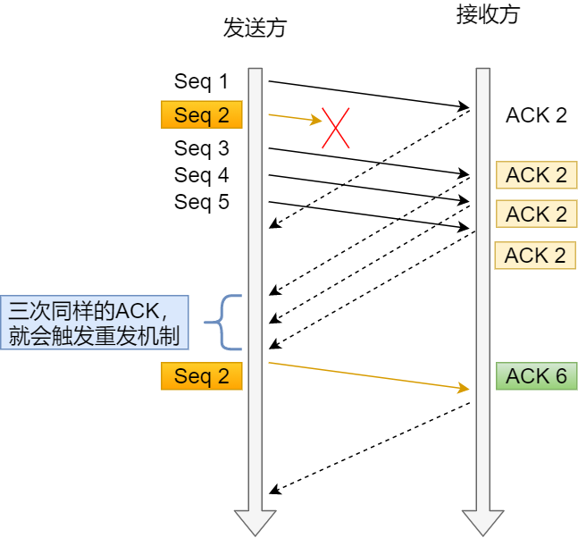

## 1. 可靠传输

**可靠：** 接收方进程从缓存区读出的字节流 与 发送方保持一致

 **TCP实现可靠传输的机制：**

**1. 伪首部二进制反码求和**

**2. 确认应答机制**

**3. 重传机制**

### 重传机制

#### 超时重传

 发送方在规定时间内，没有收到接收方的确认`ACK`，重传已发送的报文

重传机制的其中一个方式，就是在发送数据时，设定一个**定时器**，当超过指定的时间后，没有收到对方的 `ACK` 确认应答报文，就会重发该数据

TCP 会在以下两种情况发生超时重传：

- 数据包丢失
- 确认应答丢失

**重传时间**

 TCP采用自适应算法，动态改变重传时间RTTs（加权平均往返时间）

> `RTT`（Round-Trip Time 往返时延）

#### 快速重

**快速重传**：重传冗余确认，解决了超时时间的问题

快速重传的工作方式是当收到三个相同的 `ACK` 报文时，会在定时器过期之前，重传丢失的报文段。

快速重传机制

在上图，发送方发出了 1，2，3，4，5 份数据：

- 第一份 Seq1 先送到了，于是就 Ack 回 2；
- 结果 Seq2 因为某些原因没收到，Seq3 到达了，于是还是 Ack 回 2；
- 后面的 Seq4 和 Seq5 都到了，但还是 Ack 回 2，因为 Seq2 还是没有收到；
- **发送端收到了三个 Ack = 2 的确认，知道了 Seq2 还没有收到，就会在定时器过期之前，重传丢失的 Seq2**
- 最后，接收到收到了 Seq2，此时因为 Seq3，Seq4，Seq5 都收到了，于是 Ack 回 6 

 

## 2. 滑动窗口

较高的发送速度  与  较低的接收能力 不匹配，引入流量控制的窗口概念

**【接收窗口-rwnd】**： **接收方** 告知发送方自己的接收容量，反映接收方容量

**【拥塞窗口-cwnd】**： **发送方** 根据网络拥塞程度设置的窗口值，反映网络当前容量

发送窗口：Min (rwnd ， cwnd)

## 3. 流量控制

**TCP 可以让「发送方」根据「接收方」的实际接收能力控制发送的数据量，这就是所谓的流量控制**

流量控制： 让**发送方**发慢点，使接收方来得及接收，避免丢包

流量控制实现的方式：**滑动窗口机制**

> TCP并不是停等协议。发送方连续发送若干报文段，接收方进行**累计确认**

### 潜在死锁

TCP 是如何解决窗口关闭时，潜在的死锁现象呢？

若发送方没有收到  接收方  发来的窗口大小信息，为了避免双方都陷入死锁状况，会设置**持续计数器**

如果持续计时器超时，就会发送**窗口探测 ( Window probe ) 报文**

- 如果接收窗口仍然为 0，那么收到这个报文的一方就会重新启动持续计时器；
- 如果接收窗口不是 0，那么死锁的局面就可以被打破了。

 

## 4. 拥塞控制

**出现拥塞的条件** ：

**拥塞控制** ： 防止过多的数据注入到网络中，协调网络中的主机的发送速率

### 拥塞控制和流量控制的区别

### 拥塞控制的四种算法

****

**慢开始—拥塞避免**

**块重传—快恢复**x