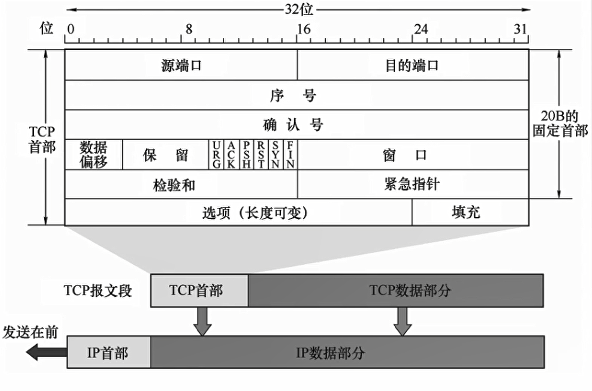

##  1. TCP协议特点

1. **面向连接**（虚连接）

2. **点对点传输**。每一条TCP连接只能有两个端点，无法进行广播或多播

3. **可靠有序，不丢不重**。TCP提供可靠的交付服务。无差错，不丢失，不重复，按序到达

4. **全双工通信**。

5. **面向字节流**。

【全双工通信】

- 发送方和接收方可以同时发送数据，接收数据。协议两端都设有发送缓存，接收缓存

【面向字节流】

- TCP将数据看成仅仅是一连串的无结构的字节流

----------------------

## 2. TCP报文首部格式

`20B`的**固定首部** + 选项字段，**4B对齐**方式

【源端口】：发送方端口，`16位`

【目的端口】：接收方端口，`16位`

【序号】：<u>本报文段</u>所发送的数据-的第一个字节的序号

【确认号】：期望收到下一个报文段数据的第一个字节的序号

【数据偏移】：TCP首部长度，最大长度为(2^4^ - 1) * 4B = `60B`，固定首部`20B` + 可变头部`40B`。由于首部长度不固定，所以数据起始位置不固定

【<mark>六个控制位</mark>】

- 紧急位`URG`：<u>发送方紧急处理位</u>。`URG=1`表示此段报文有紧急数据，要立即发送出去，不用在缓存队列中排队，配合<u>紧急指针</u>**插队优先处理**

- 确认位`ACK`：`ACK=1`，确认号有效

- 推送位`PSH`：<u>接收方紧急处理位</u>。`PSH=1`时，接收方尽快向应用进程交付此段报文，不必等缓存队列填满

- 复位`RST`：`RST=1`时，表示TCP与主机的连接**出现严重差错**，必须释放连接再重新建立

- 同步位`SYN`：`SYN=1`，表明一个连接 **请求/连接**接收报文

- 终止位`FIN`：`FIN=1`，表明发送方数据已发完，要求释放连接

【窗口】：<u>接收方接收窗口的大小</u>，即现在允许发送方发送的数据量，根据接收方的窗口大小，设置发送方的发送缓存

【检验和】：**检验首部 + 数据**，检验时要加上`12B`伪首部「伪IP数据报首部」；第四个字段为协议字段，TCP为`6`，UDP为`17`

【紧急指针】：`URG=1`时才有意义，指出本报文段中紧急数据的位置

【选项】：最大报文段长度MSS、窗口扩大、时间戳、选择确认

【填充】：填充0保证4字节对齐

### 序号&确认号

**序号：**<u>本报文段</u>所发送的数据-的第一个字节的序号

**确认号**：确认上一次发送的成功收到。期望收到下一个报文段数据的第一个字节的序号

 

序号的初始值是在建立连接后，**随机生成的**

### URG&PSH

- 紧急位`URG`：<u>发送方紧急处理位</u>。`URG=1`表示此段报文有紧急数据，要立即发送出去，不用在缓存队列中排队，配合<u>紧急指针</u>**插队优先处理**

- 推送位`PSH`：<u>接收方紧急处理位</u>。`PSH=1`时，接收方尽快向应用进程交付此段报文，不必等缓存队列填满

## 3. TCP握手挥手中seq和ack的值

**seq-序号：seq是数据包本身的序号**

**ack-确认号：ack是期望对方继续发送的那个数据包的序列号**

> [TCP三次握手机制中的seq和ack的值](https://www.jianshu.com/p/5dae584f795a)

seq是序列号，这是为了连接以后传送数据用的

ack是对收到的数据包的确认，值是等待接收的数据包的序列号

三次握手

**【握手阶段】**

1. 在第一次消息发送中，A<u>随机选取</u>一个序列号作为自己的初始序号发送给B；

2. 第二次消息B使用ack对A的数据包进行确认，因为已经收到了序列号为`x`的数据包，准备接收序列号为 `x+1` 的包，所以 `ack=x+1`，同时B告诉A自己的初始序列号，就是`seq=y`；<u>服务器端为该TCP连接分配缓存和变量</u>

3. 第三条消息A告诉B收到了B的确认消息并准备建立连接，A自己此条消息的序列号是`x+1`，所以 `seq=x+1`，而 `ack=y+1` 是表示A正准备接收B序列号为 `y+1` 的数据包；<u>客户端为该TCP连接分配缓存和变量</u>

四次挥手

**【挥手阶段】**

1. 现在，A主动发送请求`FIN=1`表示要断开连接了，A<u>随机选取</u>一个序列号作为自己的初始序号发送给B；

2. B使用ack对A的数据包进行确认，因为已经收到了序列号为`u`的数据包，准备接收序列号为 `u+1` 的包，所以 `ack=u+1`，同时B告诉A自己的初始序列号，就是`seq=v`；<u>客户到服务器这个方向的连接就成了一一半关闭状态</u>

3. 由于B可能还与他客户端同时在通信，不可能立即回复A。第三条消息B告诉A可以**数据已传输完**，我收到了你的请求`ACK=1`，现在可以断开连接了，即`FIN`。B自己此条消息的序列号是`w`，所以 `seq=w`，而 `ack`仍然为上一条的值`ack=u+1`，因为这段时间A处于半关闭状态，并没有在发送数据 。<u>服务端对A也处于半关闭状态</u>

4. 客户端A回送`ACK=1`，由于要断开连接不再发送数据了，`seq=u+1`（序号为上次B回复A的ack），`ack=w+1`。B收到后，客户端与服务器连接彻底关闭。

> 回收时客户端发送完第四次消息后，为什么要还要等待2MSL?

### 超时等待2MSL

**等待2MSL是为了确认服务器能够收到第四次挥手消息**

A发送完第四次消息后，并不知道B是否接收到了这次的消息，因为是可靠传输，但是挥手只是4次，它需要默默等待B接收到消息后才下线。（🤔PS：真实负责的好男人呀！）

如果报文丢失了或者B接收到错误的报文：

- B重复第三次挥手过程，让A再重新发送一次

TIME_WAIT 等待 2 倍的 MSL，比较合理的解释是：

网络中可能存在来自发送方的数据包，当这些发送方的数据包被接收方处理后又会向对方发送响应，所以**一来一回需要等待 2 倍的时间**。

比如，如果被动关闭方没有收到断开连接的最后的 ACK 报文，就会触发超时重发 Fin 报文，另一方接收到 FIN 后，会重发 ACK 给被动关闭方， 一来一去正好 2 个 MSL。

`2MSL` 的时间是从**客户端接收到 FIN 后发送 ACK 开始计时的**。如果在 TIME-WAIT 时间内，因为客户端的 ACK 没有传输到服务端，客户端又接收到了服务端重发的 FIN 报文，那么 **2MSL 时间将重新计时**。

