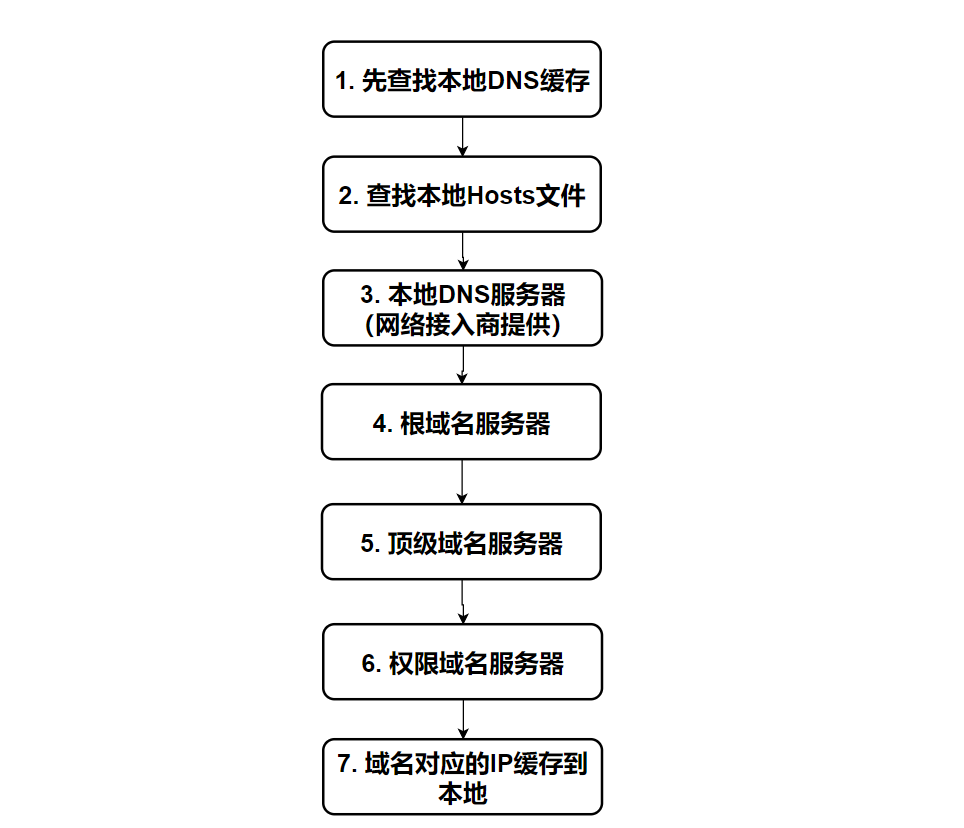
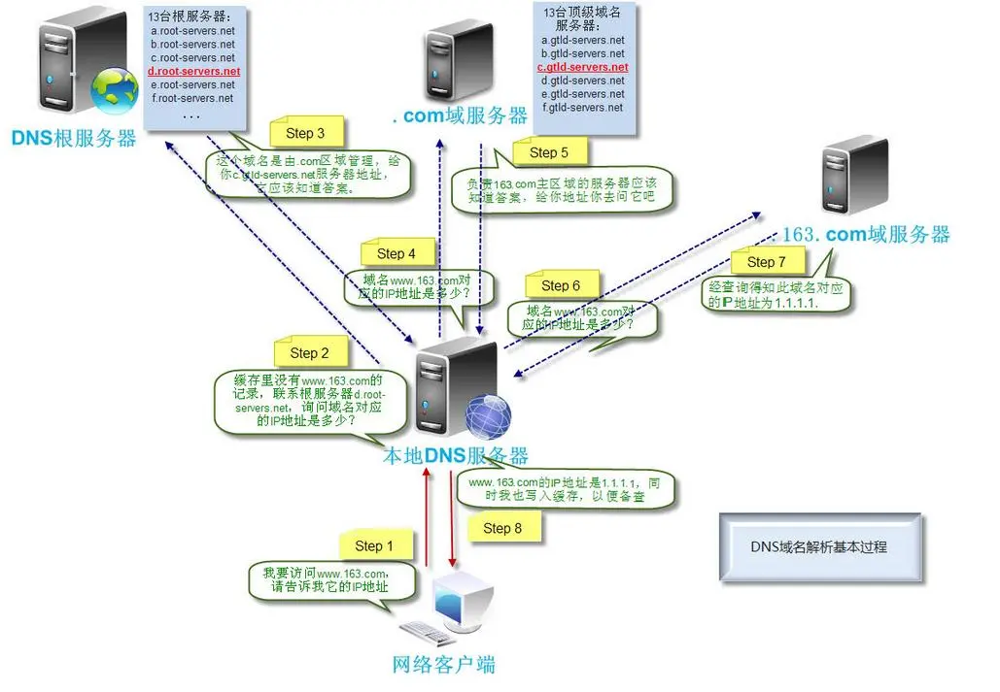
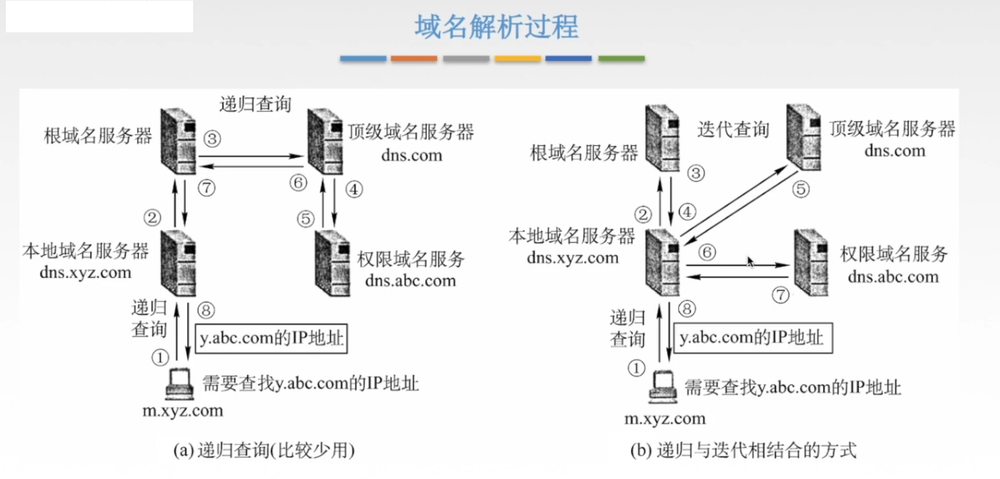

## 概念

**域名解析**：将域名解析为 IP 地址

DNS在进行域名解析时使用的是**UDP协议**

**【DNS服务器功能】**

1. 域名-映射-`IP`地址
2. 域名-映射-域名
3. 域名-映射-`URL`

 

**本地域名服务器：**

当一个主机发出DNS査询请求时，首先会发给本地域名服务器，到本地缓存中查看该域名是否存在

**根域名服务器** ：确定顶级域名服务器的范围

**顶级域名服务器**：com、cn、net、org、edu等 

**权限域名的服务器**

## DNS域名解析过程

以访问 www.163.com 这个域名为例，来看一看当你访问 www.163.com 时，会发生哪些事：

1. 先查找本地 DNS 缓存（自己的电脑上），有则返回，没有则进入下一步
2. 查看本地 **hosts **文件有没有相应的映射记录，有则返回，没有则进入下一步
3. 向本地 DNS 服务器（一般都是你的网络接入服务器商提供，比如中国电信，中国移动）发送请求进行查询，本地DNS服务器收到请求后，会先查下自己的缓存记录，如果查到了直接返回就结束了，如果没有查到，本地DNS服务器就会向**DNS根域名服务器**发起查询请求：请问老大， www.163.com 的ip是啥？
4. 根域名服务器收到请求后，发现是个` .com` 的域名，递归向下查找`.com`顶级域名服务器
5. 本地 DNS 服务器接收到回信后，向 `.com` 这个**顶级域名服务器**发起查询请求：请问 .com 大大，www.163.com 的ip 是啥？
6. `.com` 顶级域名服务器接收到请求后，看到这是 `163.com` 的域名，就回信说：这个域名是 .163.com 老弟管理的，你就去问他就行了，这是他的联系方式（ip2）
7. 本地 DNS 服务器接收到回信后，按照前辈的指引（ip2），又向 `.163.com` 这个**权威域名服务器**发起请求：请问 `163.com` 大大，请问 www.163.com 的ip是啥？
8. `163.com `**权威域名服务器**接收到请求后，确认了是自己管理的域名，马上查了下自己的小本本，把 www.163.com 的ip告诉了 本地DNS服务器。
9. 本地DNS服务器接收到回信后，将IP地址返回给本机，并做缓存

总结起来就是三句话：

1. 从"根域名服务器"查到"顶级域名服务器"的NS记录和A记录（IP地址）
2. 从"顶级域名服务器"查到"次级域名服务器"的NS记录和A记录（IP地址）
3. 从"次级域名服务器"查出"主机名"的IP地址

**系统自身的DNS缓存和本地host文件有啥区别？**

当访问一个网站时：

- 系统将从DNS缓存中读取该域名所对应的IP地址
- 当查找不到时就会到系统中查找hosts文件
- 如果还没有那么才会向DNS服务器请求一个DNS查询

> DNS缓存是内存里的东西，每次关机就消失

