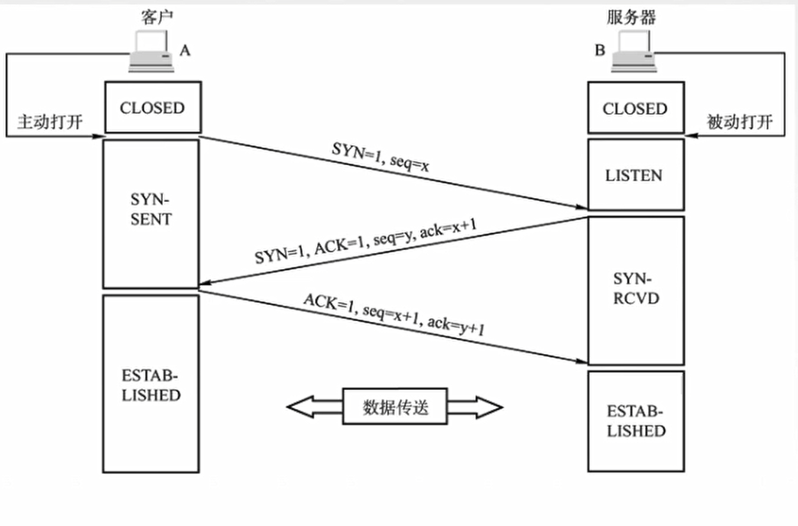
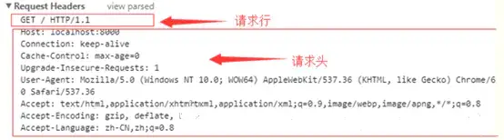
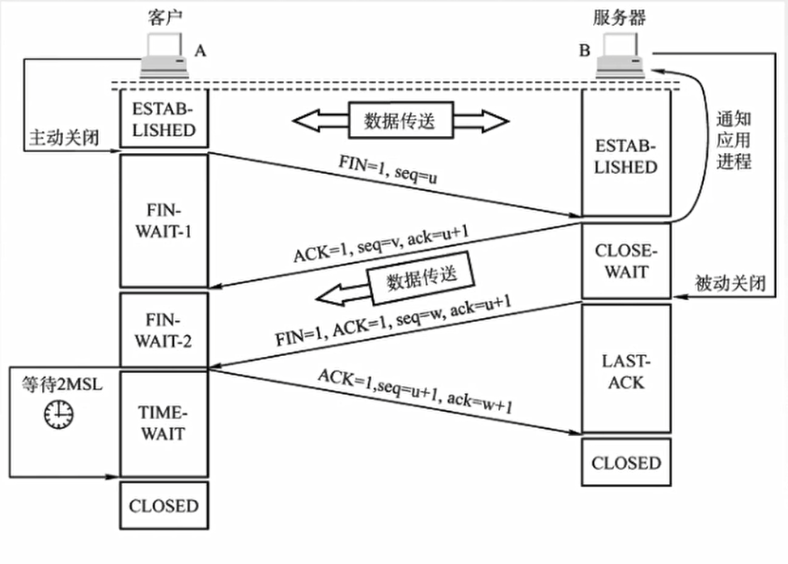

**流程总述：**

1. DNS解析：将域名解析成IP地址
2. TCP连接：TCP三次握手
3. 发送HTTP请求
4. 服务器处理请求并返回HTTP报文
5. 浏览器解析渲染页面
6. 连接结束：TCP四次挥手

## 1. DNS解析

1. 先查找本地浏览器的 DNS 缓存（浏览器的缓存），有则返回，没有则进入下一步
2. 查看本地 **hosts **文件有没有相应的映射记录，有则返回，没有则进入下一步
3. 向本地 DNS 服务器（一般都是你的网络接入服务器商提供，比如中国电信，中国移动）发送请求进行查询，本地DNS服务器收到请求后，会先查下自己的缓存记录，如果查到了直接返回就结束了，如果没有查到，本地DNS服务器就会向**DNS根域名服务器**发起查询请求
4. 根域名服务器收到请求后，发现是个` .com` 的域名，递归向下查找`.com`顶级域名服务器
5. 本地 DNS 服务器接到回信后，向 `.com` 的**顶级域名服务器**发起查询请求，发现为`163.com`，进入下一级查找
7. `163.com `**权威域名服务器**接收到请求后，确认了是自己管理的域名，把 www.163.com 的ip告诉了 本地DNS服务器
8. 本地DNS服务器接收到回信后，将IP地址返回给本机，并做缓存

 

## 2. TCP三次握手建立连接

**【握手阶段】**

1. 在第一次消息发送中，A随机选取一个序列号作为自己的初始序号发送给B；
2. **B收到了来自A的连接请求，如果在资源条件合理的情况下，服务器为该TCP连接分配缓存和变变量**。B使用ack对A的数据包进行确认，因为已经收到了序列号为`x`的数据包，准备接收序列号为 `x+1` 的包，所以 `ack=x+1`，同时B告诉A自己的初始序列号，就是`seq=y`；<u>服务器端为该TCP连接分配缓存和变量</u>
3. 第三条消息A告诉B收到了B的 确认消息并准备建立连接，A自己此条消息的序列号是`x+1`，所以 `seq=x+1`，而 `ack=y+1` 是表示A正准备接收B序列号为 `y+1` 的数据包；<u>客户端为该TCP连接分配缓存和变量</u>

 

## 3. 浏览器向web服务器发送HTTP请求

TCP三次握手之后，开始发送HTTP请求报文至服务器

HTTP请求报文格式：`请求行` +  `请求头` +  `空行` + `消息体`

请求行包括请求方式（GET/POST/DELETE/PUT）、请求资源路径（URL）、HTTP版本号；

【默认GET请求，默认HTTP1.1，默认长连接`Connection:kerp-alive`】

 

## 4. 服务器处理请求并返回HTTP报文

服务器收到请求后会发出应答，即响应数据。

HTTP响应报文格式：`状态行` + `响应头` + `空行` + `消息体`

状态行包括HTTP版本号、状态码、状态说明

 

## 5. 浏览器解析渲染页面

浏览器拿到响应文本后，解析HTML代码，请求js，css等资源，最后进行页面渲染，呈现给用户。

页面渲染一般分为以下几个步骤：

1. 根据HTML文件解析出DOM Tree
2. 根据CSS解析出 CSSOM Tree(CSS规则树)
3. 将 DOM Tree 和 CSSOM Tree合并，构建Render tree(渲染树)
4. reflow(重排)：根据Render tree进行节点信息计算（Layout）
5. repaint(重绘)：根据计算好的信息绘制整个页面（Painting）

 

## 6. TCP四次挥手断开连接

**【挥手阶段】**

1. 客户端打算关闭连接，此时会发送一个 TCP 首部 `FIN` 标志位被置为 `1` 的报文，A随机选取一个序列号作为自己的初始序号发送给B，之后客户端进入 `FIN_WAIT_1` 状态。
2. B使用`ACK`对A的数据包进行确认，回复确认号`ack=u+1`，同时B告诉A自己的初始序列号，就是`seq=v`；<u>客户到服务器这个方向的连接就成了一一半关闭 `CLOSED_WAIT` 状态</u>。由于B可能还与他客户端同时在通信，或者可能此时对A的数据没有发送完，这次不会回复`FIN`标志位。
3. 第三条消息B告诉A可以断开连接，数据已传输完，。即回复`FIN=1`，同时回复`ACK`确认。B自己此条消息的序列号是`w`，并恢复确认号`ack=u+1`，因为这段时间A处于半关闭状态，并没有在发送数据 。<u>服务端进入 `LAST_ACK` 状态</u>
4. 客户端A回送`ACK=1`，由于要断开连接不再发送数据了，`seq=u+1`（序号为上次B回复A的ack），`ack=w+1`。服务器收到消息后进入了 `CLOSE` 状态之后进入 `TIME_WAIT` 状态。客户端在等待**2MSL**后，确保B收到A恢复的消息后，自动进入 `CLOSE` 状态，至此客户端也完成连接的关闭。

