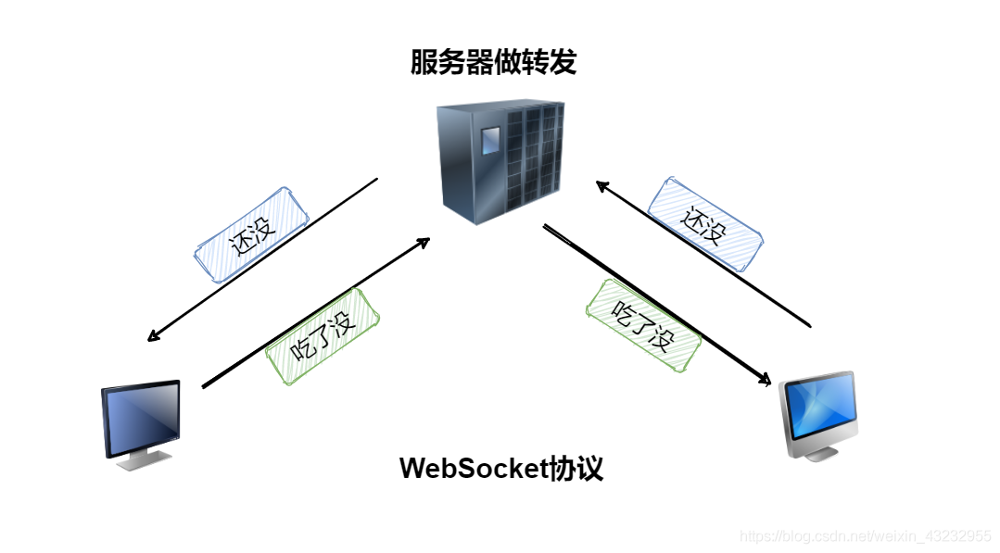
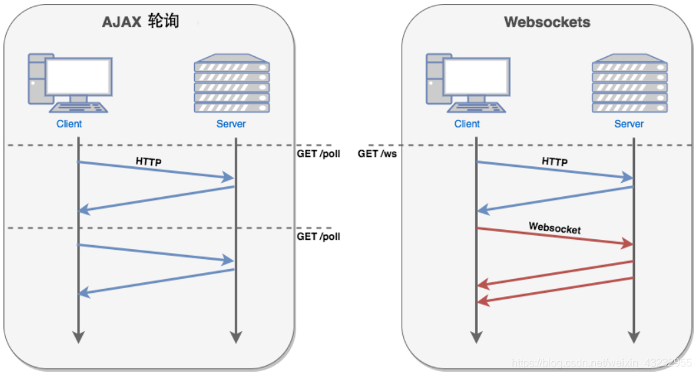
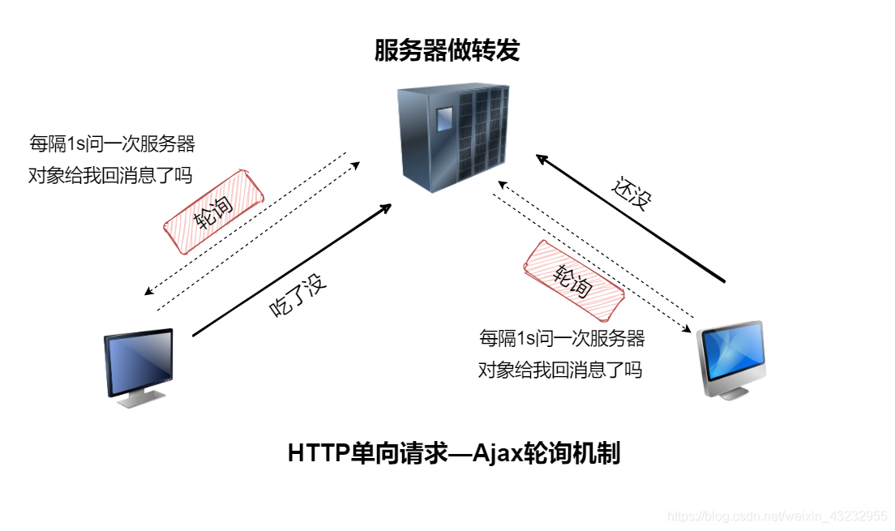
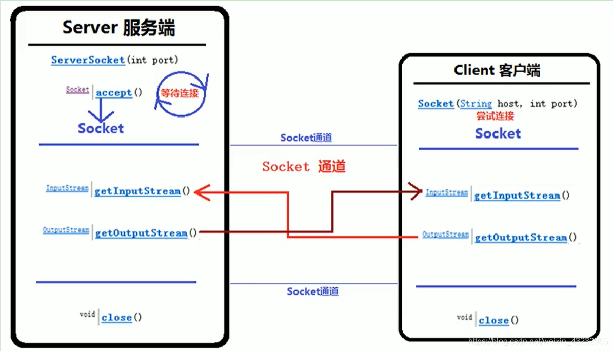
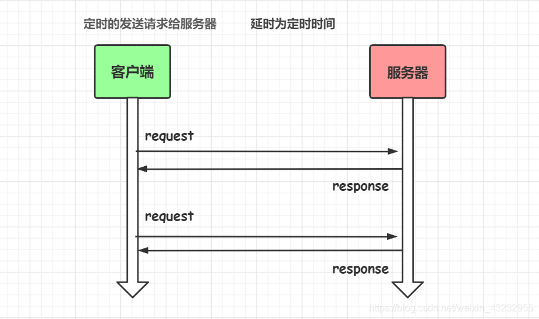
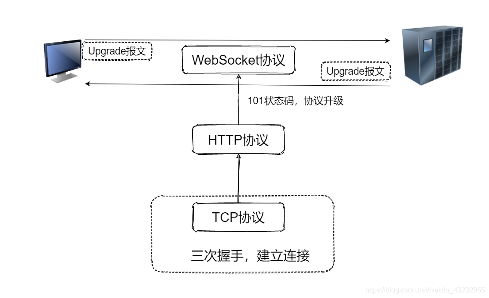
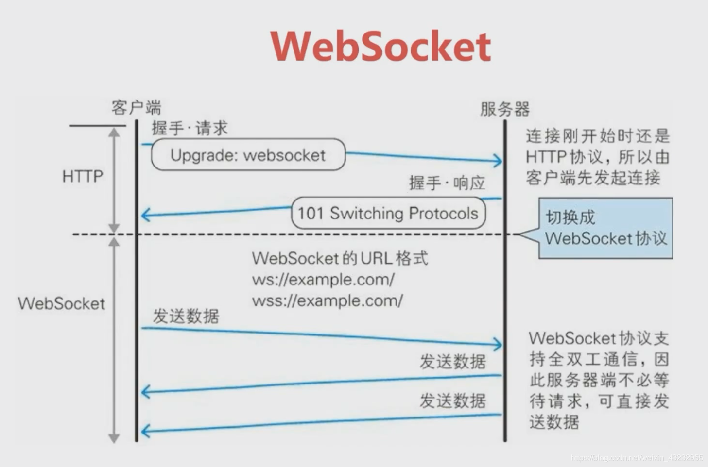
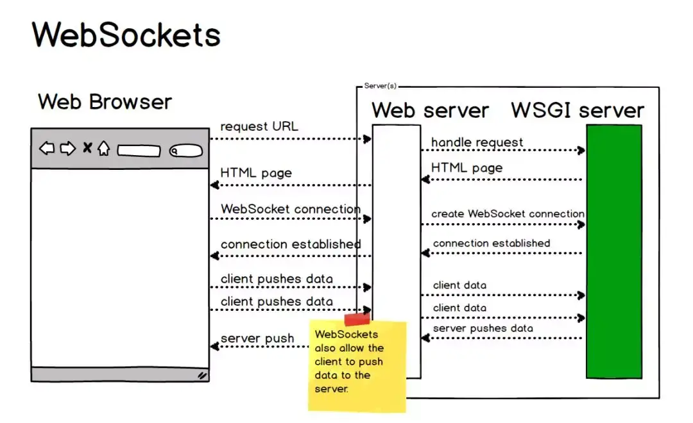
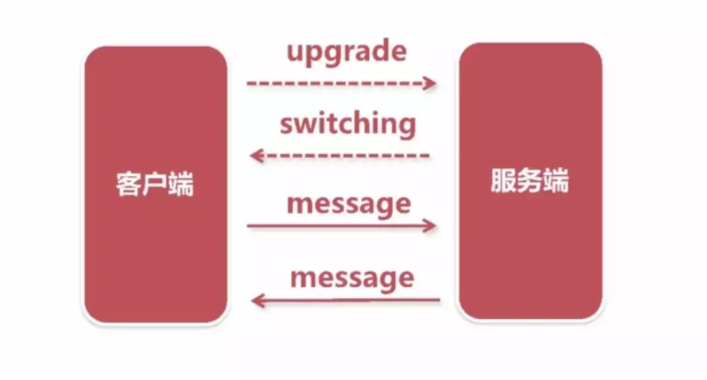

## 1. WebSocket简介

Websocket是一种网络通信协议。

Websocket是**HML5**开始提供的一种在**单个TCP连接上进行全双工通讯**的协议。没有了 Request 和 Response 的概念，两者地位完全平等，连接一旦建立，就建立了真•持久性连接，双方可以随时向对方发送数据。使得服务器和客户端交互数据更加简单。

浏览器和客户端只需要完成一次握手，就可以创建持久性的连接，并进行双向的数据传输




HTTP协议是一种无状态的、无连接的、单向的应用层协议。它采用了**请求 / 响应**模型。**通信请求只能由客户端发起，服务端对请求做出应答处理**

这种通信模型有一个弊端：HTTP协议无法实现服务器**主动**向客户端发起消息。




这种**单向请求**的特点，注定了如果服务器有连续的状态变化，客戶端要获知就非常麻烦。

- 因为服务器不会主动回复客户端说我这里有数据变化
- 只能是客户端问服务器有没有数据发生变化，服务器给客户端做回应。

为了保持长时间的通信连接，就需要同步客户端不断地发送请求询问，称为**轮询**。

大多数Web应用程序将通过频繁的异步AJAX请求实现**长轮询**。轮询的效率低，非常浪费资源（因为必须不停连接，或者HTTP连接始终打开）




所以 WebSocket 和 HTTP 有一些交集，两者相异的地方还是很多。两者交集的地方在 HTTP 握手阶段，握手成功后，数据就直接从 TCP 通道传输。

> **轮询**：在客户端定时的向服务器发送AJAX请求，获取服务端最新的数据

### 1.1 为什么要选择WebSocket

轮询都是先由客户端发起 Ajax 请求，才能进行通信，走的是HTTP协议，服务器端无法主动向客户端推送信息。

当出现类似体育赛事、聊天室、实时位置之类的场景时，**轮询就显得十分低效和浪费资源**。

**选择WebSocket的理由：**

- **全双工通信，服务器和客户端可以互相主动通信**。由于协议是全双工的，所以服务器可以随时主动给客户端下发数据。而HTTP协议中服务器不能主动向客户端发送请求，是单向通信的
- **较少的控制开销**。协议控制的数据包头部相对较小，长连接减少了每次连接时握手挥手的资源消耗
- **保持长连接状态，实时性**。HTTP要不断发送请求来保持连接，否则服务器响应完客户端就断开连接了

### 1.2 选其他

**Socket网络编程**

- Socket在应用之间建立信道连接，通过`IO`流来传输数据
- 基于**JFrame**，封装性、易用性低




基于TCP协议

【客户端】：

- 创建客户端套接字（尝试连接）
- 等待连接
- 获取输入流、输出流
- 关闭连接

【服务端】：

- 创建服务端套接字
- 等待连接
- 获取输入流、输出流
- 关闭连接

【数据传输】：在两个套接字建立的`socket`通道中进行传输数据流

<br>

----------------

## 2. WebSocket协议通信原理

**HTTP协议：**




延时时间长，而且只能是单向通信，单次通信完，连接就断开了。

### 2.1 协议升级

**WebSocket协议是建立在HTTP协议基础之上的，在建立HTTP协议时，传输层如果是TCP协议就必然经历过了三次握手**

客户端发送`Upgrade`请求头来告知服务端协议升级，想要建立一个 WebSocket 连接。




**【101状态码】**

当客户端在请求里使用`Upgrade`报头，通知服务器它想改用除HTTP协议之外的其他协议时，客户端将获得此响应代码。**101**响应代码表示“行，我现在改用另一个协议了”。

通常HTTP客户端会在收到服务器发来的101响应后**关闭与服务器的TCP连接**。101响应代码意味着，该客户端不再是一个HTTP客户端，而将成为另一种客户端。

### 2.2 建立WebSocket连接

在客户端建立一个 WebSocket 连接非常简单：

```javascript
var ws = new WebSocket('ws://localhost:9000');
```

请求的 URL 是` ws:// `或者 `wss:// `开头的，而不是 HTTP:// 或者 HTTPS://

### 2.3 握手

WebSocket协议的建立是基于HTTP协议之上的，先建立HTTP协议，然后通过发送`101`状态码，使用`Upgrade`报头升级为**WebSocket**协议



WebSocket协议有两部分：**握手**和**数据传输**，握手是基于HTTP协议的



### 2.4 请求数据

客户端request请求头：

```http
GET ws://localhostchat HTTP/1.1
Host: localhost
Upgrade: websocket  //表示要升级到websocket协议
Connection: Upgrade
Sec-WebSocket-Extensions: permessage-deflate;
Sec-WebSocket-Key: 5fTJ1LTuh3RKjSJxydyifQ==		// 与响应头 Sec-WebSocket-Accept 相对应
Sec-WebSocket-Version: 13	//表示websocket协议的版本	
```

服务端response响应头：

```http
HTTP/1.1 101 Switching Protocols
Upgrade: websocket
Connection: Upgrade
Sec-WebSocket-Accept: ZUip34t+bCjhkvxxwhmdEOyx9hE=
Sec-WebSocket-Extensions: permessage-deflate;
```

【字段说明】

| 头名称                    | 说明                                                         |
| ------------------------- | ------------------------------------------------------------ |
| Connection: Upgrade       | 表示该HTTP请求是一个人协议升级请求                           |
| Upgrade: websocket        | 协议升级为WebSocket协议                                      |
| Sec-WebSocket-Version: 13 | 表示websocket协议的版本                                      |
| Sec-WebSocket-Key         | **与响应头 Sec-WebSocket-Accept 相对应，用来唯一标识客户端和服务器** |
| Sec-WebSocket-Extensions  | 协议拓展                                                     |

## 4. 客户端通信

### 4.1 WebSocket对象

	创建WebSocket对象：

```javascript
var ws = new WebSocket(url);  //请求的地址
```

> 参数url格式：`ws://ip地址:端口号/资源名称`

### 4.2 WebSocket事件

WebSocket对象的相关事件：

| 事件    | 事件处理程序            | 描述                       |
| ------- | ----------------------- | -------------------------- |
| open    | websocket对象.onopen    | 连接建立时触发             |
| message | websocket对象.onmessage | 客户端接收服务端数据时触发 |
| error   | websocket对象.onerror   | 通信发生错误是触发         |
| close   | websocket对象.onclose   | 连接关闭时触发             |

### 4.3 WebSocket方法

WebSocket对象的相关方法：

`send()`：使用连接发送数据

## 5. 服务端通信

Java Websocket应用由一系列的 `WebSocketEndpoint`组成。 `Endpoint`是一个java对象，代表 WebSocket链接的一端。对于服务端，我们可以视为处理具体WebSocket消息的接口，就像Servlet之与HTTP请求一样。
我们可以通过两种方式定义 Endpoint：

- 第一种是编程式，即继承类 `javax.websocket`，Endpoint并实现其方法
- 第二种是注解式，即定义一个`POJO`，并添加 `ServerEndpoint`相关注解

`Endpoint`实例在 WebSocket握手时创建，并在客户端与服务端链接过程中有效，最后在链接关闭时结束。在Endpoint接口中明确定义了与其生命周期相关的方法，规范实现者确保生命周期的各个阶段调用实例的相关方法。生命周期方法如下：

| 方法      | 含义                                             | 注解       |
| --------- | ------------------------------------------------ | ---------- |
| onClose   | 当会话开启时调用                                 | @OoClose   |
| onOpen    | 当开启一个新的会话，客户端与服务器握手成功后调用 | @OnOpne    |
| onError   | 连接规程中产生异常                               | @OnError   |
| OnMessage | 客户端接收服务端数据时触发                       | @OnMessage |

**服务端如何接收客户端发送的数据呢？**

通过为 Session添加 MessageHandler消息处理器来接收消息，当采用注解方式定义 Endpoint时，我们还可以通过`@OnMessage`注解指定接收消息的方法。

**服务端如何推送数据绐客户端呢？**

发送消息则由 RemoteEndpoint完成，其实例由 session维护，根据使用情况，我们可以通过`Session.getBasicRemote`获取同步消息发送的实例，然后调用其 `sendXxx()`方法就可以发送消息，可以通过`Session.getAsyncRemote`获取异步消息发送实例

### 心跳保活

在实际使用 WebSocket 中，长时间不通消息可能会出现一些连接不稳定的情况，这些未知情况导致的连接中断会影响客户端与服务端之前的通信，

为了防止这种的情况的出现，有一种心跳保活的方法：客户端就像心跳一样每隔固定的时间发送一次 ping，来告诉服务器，我还活着，而服务器也会返回 pong，来告诉客户端，服务器还活着。ping/pong 其实是一条与业务无关的假消息，也称为心跳包。

可以在连接成功之后，每隔一个固定时间发送心跳包，比如 60s:

```javascript
setInterval(() => {
    ws.send('这是一条心跳包消息');
}, 60000)
```



通过上面的介绍，大家应该对 WebSocket 有了一定认识，其实并不神秘，这里对文章内容简单总结一下。当创建 WebSocket 实例的时候，会发一个 HTTP 请求，请求报文中有个特殊的字段 Upgrade，然后这个连接会由 HTTP 协议转换为 WebSocket 协议，这样客户端和服务端建立了全双工通信，通过 WebSocket 的 send 方法和 onmessage 事件就可以通过这条通信连接交换信息。

---------------

【参考资料】

- [阮一峰的网络日志](http://www.ruanyifeng.com/blog/2017/05/websocket.html)
- [HTML5 WebSocket](https://www.runoob.com/html/html5-websocket.html)