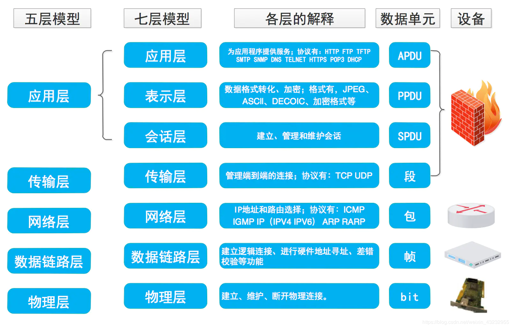
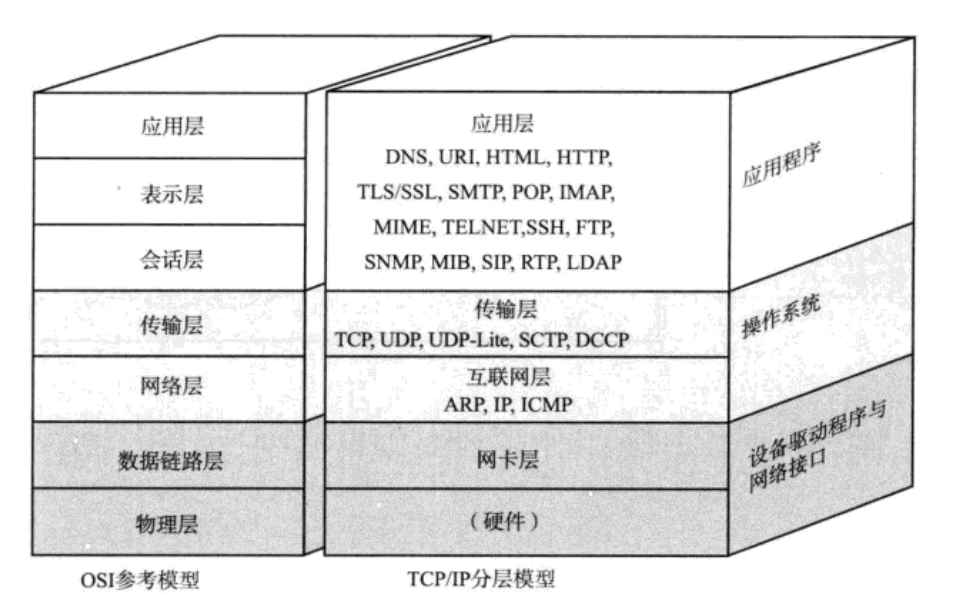
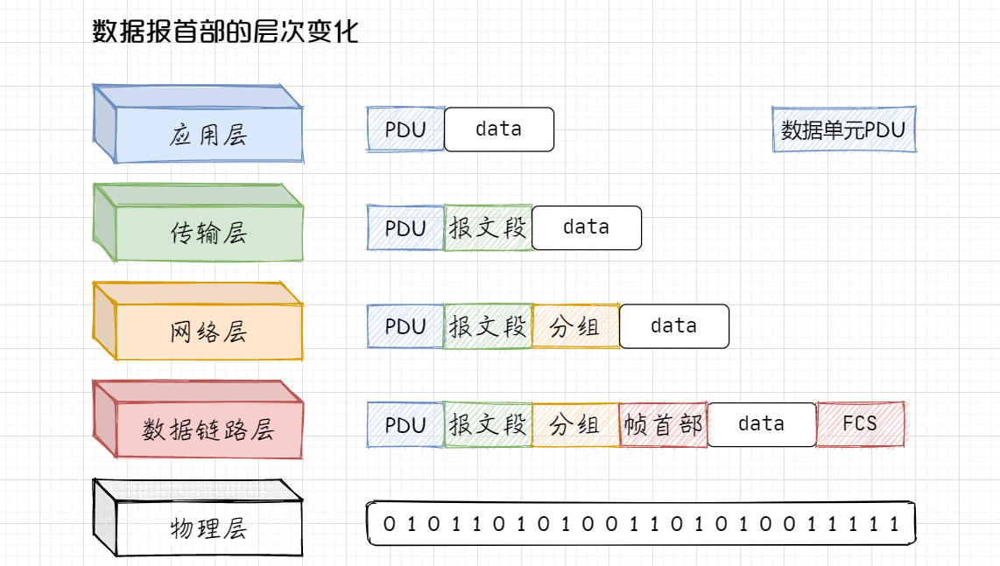

## 每层的作用

**应用层：** 为应用程序提供服务

**表示层：** 数据格式的转化。将数据从 “某个计算机特定的数据格式” 转换为 “网络通用的标准数据格式” 再发送出去

**会话层：** 简历、管理、维护会话，决定数据如何高效的交互和传输

**传输层：** 

- 提供进程与进程之间的逻辑通信
- 复用和分用服务
- 对接收到的<u>报文</u>进行**差错检验**

**网络层：**

- 数据传输。将数据从一个主机传输到另一个主机
- 寻址。根据子网划分和IP地址，寻找目的主机地址
- 路由选择。选择数据在互联网上的传输路径

**数据链路层：** 通过传输介质，在互连的设备之间进行数据处理

**物理层：** 实际的光电信号的传输

 

**【传输单元名词解析】**

